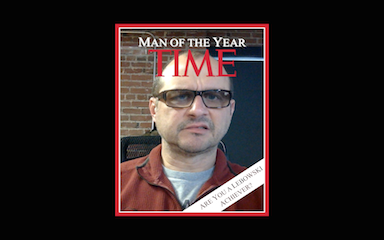

### ARE YOU A LEBOWSKI ACHIEVER?

The Achiever screen saver uses your Mac's camera to show your mirror image in the Man of the Year magazine cover, just like The Dude.

1. Download the [latest release](https://github.com/kolpanic/Achiever/releases), and expand the archive.
2. Move `Achiever.qtz` to `~/Library/Screen Savers/`. If your Library folder is not visible, you can [show it in the Finder](http://support.apple.com/kb/PH18928?viewlocale=en_US).
3. Open System Preferences (under the  menu). Click on the Desktop & Screen Saver icon, and choose the Screen Saver tab.
4. Select Achiever from the list of available screen savers on the left.
5. Move your mouse over the preview image, and click the Preview button.

You can also use [Hot Corners](http://support.apple.com/kb/PH18796?viewlocale=en_US) to activate the screen saver whenever you want, and [Require a Password](http://support.apple.com/kb/PH18669?viewlocale=en_US) to deactivate the screen saver.

It's just a Quartz composition, so It should work with recent versions of macOS up to and including 10.13. Also, you should be able to open `Achiever.qtz` in Quicktime Player if you just want to preview it.  However, your mileage may vary. There are no guarantees.

### Mojave

Apple says Quartz compositions are no longer supported as screen savers in macOS 10.14. In addition, Achiever.qtz can't be opened by Quartz Composer on 10.14 because the app doesn't have the entitlements required to use the camera.

However, you _can_ open Achiever.qtz with Quicktime Player—the first time, you'll be prompted to allow camera access.

*The Dude abides.*
